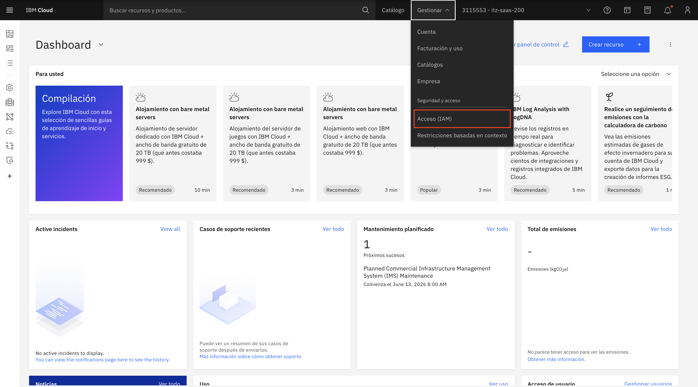
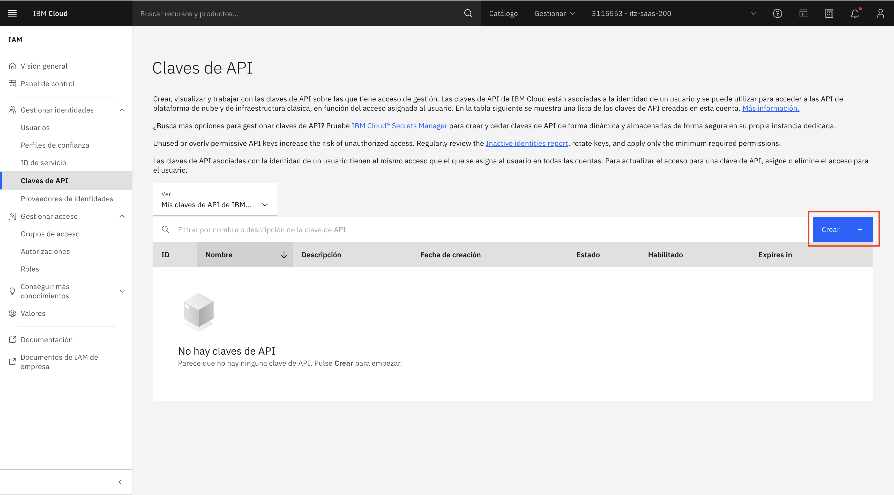
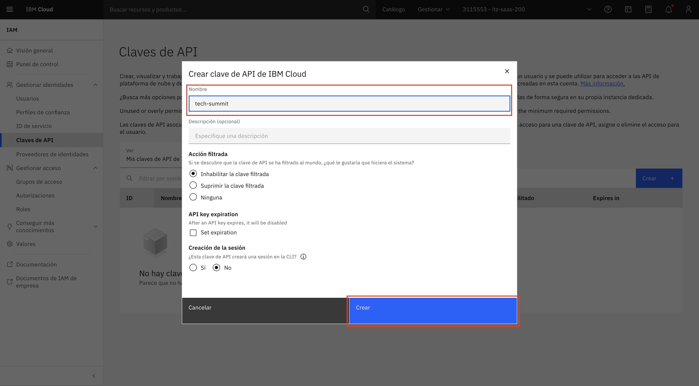
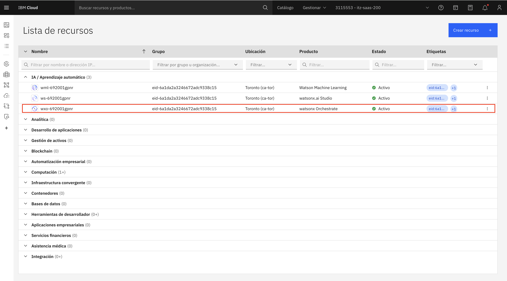
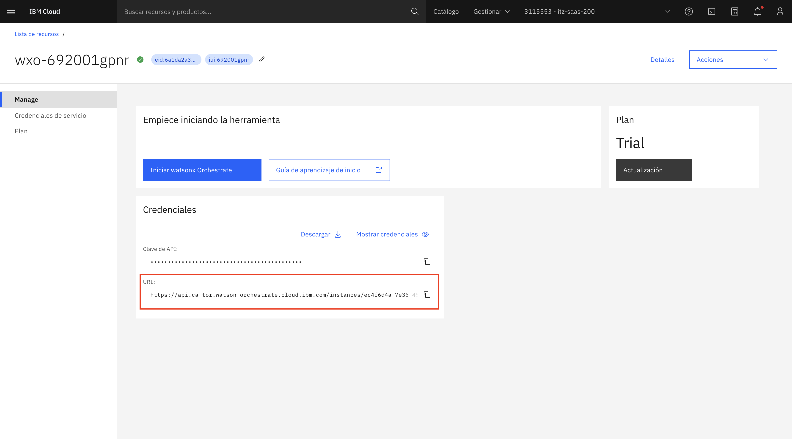
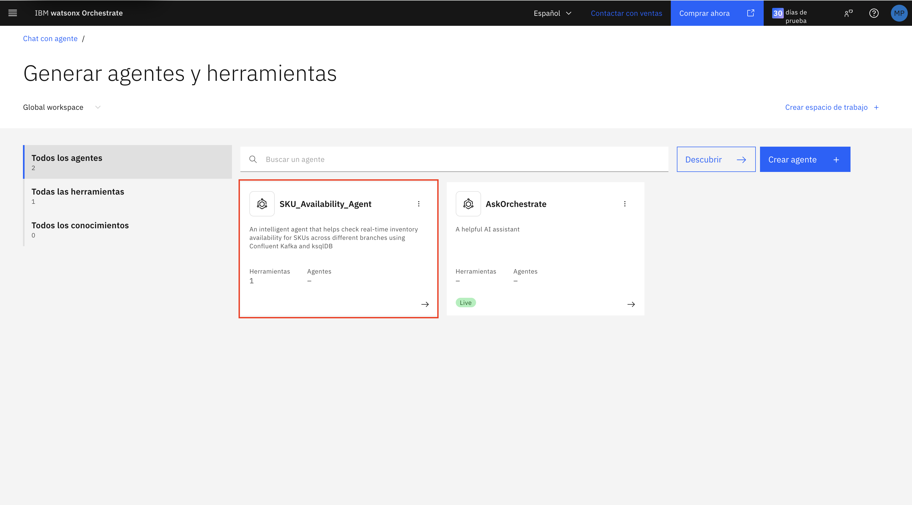
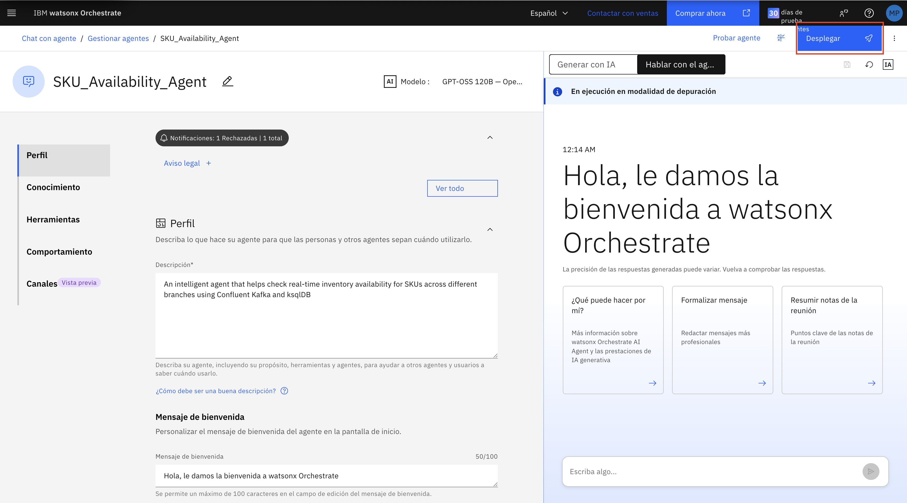
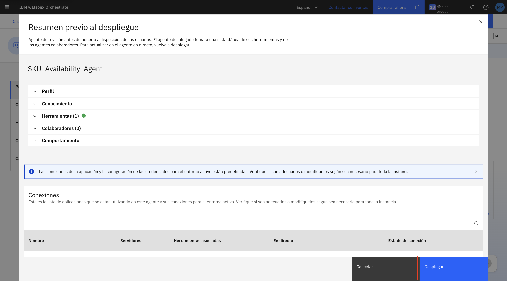

# Lab 2 - IA agéntica con Confluent y watsonx Orchestrate

En este laboratorio vas a construir un sistema multiagente para asistir a una tienda retail. El sistema combina eventos de inventario en tiempo real, provistos por Confluent Cloud, con agentes de IA creados en IBM watsonx Orchestrate.

El objetivo es que los agentes puedan responder preguntas de disponibilidad, sugerir sustitutos cuando un producto no tiene stock y, finalmente, asistir a un cliente final desde una experiencia conversacional.

## Qué vas a construir

Durante el lab vas a crear y probar cuatro componentes:

1. **SKU Availability Agent**: consulta stock en tiempo real usando una herramienta MCP conectada a Kafka y ksqlDB.
2. **Substitute Finder Agent**: usa RAG agéntico sobre un catálogo de productos para recomendar sustitutos.
3. **Store Associate Agent**: actúa como supervisor para un asociado de tienda y coordina los dos agentes anteriores.
4. **Customer Shopping Assistant**: asiste al cliente final, recomienda productos según su necesidad y verifica disponibilidad.

Al finalizar, también vas a obtener el snippet de watsonx Orchestrate necesario para embeber el asistente en una web. Ese snippet se usará en el Lab 3.

## Estructura general del flujo

El lab avanza de menor a mayor complejidad:

1. Primero se configura el entorno local, IBM Cloud, watsonx Orchestrate y, si corresponde, Confluent Cloud.
2. Luego se importa una herramienta MCP para consultar disponibilidad de SKUs.
3. Después se crean agentes especializados: uno para inventario y otro para sustitutos.
4. Finalmente se crean agentes supervisores que combinan capacidades y entregan respuestas orientadas al negocio.

---

# Prerrequisitos

Antes de comenzar, completá esta sección. Si ya participaste del Lab 1 de Confluent y tenés tu entorno configurado, prestá especial atención al prerrequisito condicional de Confluent para confirmar si necesitás ejecutarlo o no.

## 1. Clonar el repositorio

Cloná el repositorio oficial del laboratorio:

```bash
git clone https://github.com/ignacio-ibm00/Repo-TechSummit-Lab2.git
```

Luego posicionate en la carpeta que contiene los agentes, herramientas y archivos de datos:

```bash
cd Repo-TechSummit-Lab2/confluent_agents
```

En esta carpeta vas a encontrar los archivos principales del lab:

- `get_sku_availability.py`: herramienta MCP para consultar inventario.
- `sku-availability-agent.yaml`: definición del agente de disponibilidad.
- `Substitute_Finder_Agent.yaml`: definición del agente buscador de sustitutos.
- `Store_Associate_Agent.yaml`: definición del agente supervisor para asociados de tienda.
- `Customer_Shopping_Assistant.yaml`: definición del asistente para clientes.
- `product-catalog.docx`: catálogo de productos usado como base de conocimiento.

## 2. Crear una IBM Cloud API Key

Necesitás una API Key de IBM Cloud para autenticarte con watsonx Orchestrate desde el ADK.

1. Iniciá sesión en IBM Cloud: [https://cloud.ibm.com/login](https://cloud.ibm.com/login)
2. En el menú **Gestionar**, seleccioná **Acceso (IAM)**.

   
3. En el menú **Claves de API**, hacé clic en **Crear**.

   
4. Ingresá un nombre para la API Key.

   
5. Hacé clic en **Crear**.
6. Copiá y guardá la API Key en un lugar seguro.

> **Importante:** No vas a poder ver la API Key nuevamente después de cerrar la ventana. Tratala como una contraseña y no la compartas públicamente.

## 3. Instalar y configurar el ADK de watsonx Orchestrate

El **Agent Development Kit (ADK)** permite importar herramientas y agentes en watsonx Orchestrate desde la línea de comandos.

### 3.1. Instalar el ADK

Ejecutá:

```bash
pip install --upgrade ibm-watsonx-orchestrate
```

### 3.2. Crear un ambiente del ADK

El ADK usa ambientes para gestionar conexiones a distintas instancias de watsonx Orchestrate.

```bash
orchestrate env add -n <nombre_del_ambiente> -u <url_instancia_wxo>
```

Reemplazá:

- `<nombre_del_ambiente>` por un nombre descriptivo, por ejemplo `labtech`.
- `<url_instancia_wxo>` por la URL de tu instancia de watsonx Orchestrate.

### 3.3. Obtener la URL de watsonx Orchestrate

1. Accedé al dashboard de IBM Cloud: [https://cloud.ibm.com](https://cloud.ibm.com)
2. Abrí el menú de hamburguesa.

   
3. Seleccioná **Lista de recursos**.

   
4. Seleccioná tu instancia de **watsonx Orchestrate** dentro de **IA / Aprendizaje automático**.

   
5. Copiá la URL de la instancia.

   

### 3.4. Activar el ambiente

Ejecutá:

```bash
orchestrate env activate <nombre_del_ambiente>
```

Cuando se solicite, ingresá la IBM Cloud API Key que creaste previamente.

> **Importante:** Guardá el nombre del ambiente. Si el token expira durante el lab, vas a necesitar activarlo nuevamente. Al final del documento hay una sección de troubleshooting con el comando correspondiente.

Para más información, podés consultar la [documentación oficial del ADK](https://developer.watson-orchestrate.ibm.com/getting_started/installing).

## 4. Configurar Confluent si no participaste del Lab 1

Este paso es **condicional**.

Si participaste del Lab 1 de Confluent, ya deberías tener creada la capa de eventos en tiempo real: tópico Kafka, procesamiento de inventario y eventos de ejemplo.

Si **no** participaste del Lab 1, ejecutá este paso para crear automáticamente los recursos necesarios para este laboratorio.

### 4.1. Verificar el archivo `.env`

Asegurate de tener un archivo `.env` dentro de `confluent_agents/` con las credenciales de Confluent Cloud. Podés usar `.env.example` como referencia.

### 4.2. *agregar ./setup.sh*

---

# Paso 1 - Crear la herramienta MCP y el agente de disponibilidad

En este paso vas a crear el primer agente del lab: **SKU Availability Agent**. Este agente consulta la disponibilidad de productos en tiempo real a través de una herramienta MCP.

## Objetivo del paso

Al finalizar este paso, vas a tener:

- Una herramienta MCP registrada en watsonx Orchestrate.
- Un agente capaz de invocar esa herramienta.
- Una primera prueba de disponibilidad de inventario funcionando desde la UI.

## 1.1. Importar la herramienta MCP

Una herramienta MCP expone una función externa para que un agente pueda invocarla. En este caso, la herramienta ejecuta `get_sku_availability.py`, que consulta disponibilidad de inventario usando Kafka y ksqlDB.

Desde `Repo-TechSummit-Lab2`, ejecutá:

```bash
orchestrate toolkits add --kind mcp --name "sku-availability-checker" --description "Verificador de disponibilidad de inventario en tiempo real usando Confluent Kafka y ksqlDB" --language python --package-root "confluent_agents" --command "python get_sku_availability.py" --tools "*"
```

## 1.2. Importar el agente de disponibilidad

El archivo `sku-availability-agent.yaml` define el comportamiento del agente, su descripción y la herramienta que puede usar.

Ejecutá:

```bash
orchestrate agents import -f confluent_agents/sku-availability-agent.yaml
```

> **Nota:** Si después de importar el agente no lo ves en la UI de watsonx Orchestrate, recargá la página.

## 1.3. Acceder a watsonx Orchestrate

Si todavía no tenés abierta la interfaz:

1. Accedé al dashboard de IBM Cloud: [https://cloud.ibm.com](https://cloud.ibm.com)
2. Abrí el menú de hamburguesa.
3. Seleccioná **Lista de recursos**.
4. Seleccioná tu instancia de **watsonx Orchestrate**.
5. Hacé clic en **Iniciar watsonx Orchestrate**.

   
6. En la UI, ingresá a **Crear**.

   

## 1.4. Desplegar el agente

1. Buscá el agente `SKU_Availability_Agent`.
2. Abrilo desde la lista de agentes.

   
3. En la esquina superior derecha, hacé clic en **Desplegar**.

   
4. Confirmá el despliegue en la ventana de resumen.

   

## 1.5. Probar el agente

Usá una pregunta como esta:

```text
¿Cuáles son los SKUs disponibles en Dot Shopping?
```

Resultado esperado: el agente devuelve la disponibilidad actual de los SKUs para la sucursal indicada y marca los productos sin stock cuando corresponda.

> **Nota:** Los nombres de sucursales dependen de los datos cargados en Confluent. En los datos de muestra de este repositorio aparecen, por ejemplo, `Dot Shopping` y `Unicenter`.

---

# Paso 2 - Crear el agente RAG para encontrar sustitutos

En este paso vas a crear el **Substitute Finder Agent**. Este agente no consulta inventario en tiempo real; su función es razonar sobre el catálogo de productos para encontrar alternativas similares cuando un SKU no está disponible.

## Objetivo del paso

Al finalizar este paso, vas a tener:

- Un agente especializado en búsqueda de sustitutos.
- Una base de conocimiento creada a partir de `product-catalog.docx`.
- Pruebas de recuperación y similitud semántica.

## 2.1. Importar el agente

Desde `Repo-TechSummit-Lab2/confluent_agents`, ejecutá:

```bash
orchestrate agents import -f Substitute_Finder_Agent.yaml
```

> **Nota:** Si el agente no aparece después de importarlo, recargá la UI de watsonx Orchestrate.

## 2.2. Desplegar el agente

1. En la UI de watsonx Orchestrate, abrí el agente `Substitute_Finder_Agent`.
2. Hacé clic en **Desplegar**.
3. Confirmá el despliegue en la ventana de resumen.

En este punto el agente está creado y desplegado, pero todavía no tiene acceso al catálogo de productos. Eso se configura en el siguiente paso.

## 2.3. Subir el catálogo de productos

El archivo `product-catalog.docx` representa un catálogo interno de productos. El agente lo usa como fuente de conocimiento para recuperar especificaciones y comparar productos.

El catálogo incluye productos como:

- `LAPTOP-DELL-XPS-15`
- `LAPTOP-HP-SPECTRE-X360`
- `LAPTOP-MACBOOK-PRO-16`
- `MOBILE-IPHONE-17-PRO-MAX`
- `MOBILE-SAMSUNG-S24-ULTRA`
- `MOBILE-GOOGLE-PIXEL-8-PRO`

Estos productos comparten atributos como categoría, procesador, memoria, almacenamiento, factor de forma y casos de uso. Esa superposición permite que el agente identifique sustitutos por similitud semántica.

## 2.4. Crear la base de conocimiento

Dentro del agente `Substitute_Finder_Agent`:

1. Ingresá a la sección **Conocimiento**.
2. Hacé clic en **Añadir origen**.
3. Seleccioná la opción para crear una nueva base de conocimiento.
4. Elegí la carga de archivo local.
5. Hacé clic en **Cargar archivos**.
6. Seleccioná `product-catalog.docx`.
7. Hacé clic en **Next**.
8. Usá el nombre `enterprise_documents`.
9. Agregá una descripción, por ejemplo: `Catálogo de productos con especificaciones técnicas, casos de uso y características destacadas`.
10. Hacé clic en **Save**.
11. Esperá hasta que finalice la indexación.
12. Verificá que el documento figure como disponible.

## 2.5. Probar el agente

Primero validá que el agente pueda recuperar información del catálogo:

```text
Del catálogo de productos empresariales, recuperá la entrada para el SKU LAPTOP-DELL-XPS-15 y listá sus atributos clave.
```

Resultado esperado: el agente recupera la entrada del catálogo y lista los atributos definidos en el documento.

Luego probá una recomendación por similitud:

```text
LAPTOP-DELL-XPS-15 no está disponible. Sugerí una laptop similar usando el catálogo de productos.
```

Resultado esperado: el agente recomienda una laptop similar del catálogo y explica brevemente qué atributos comparte con el producto solicitado.

---

# Paso 3 - Crear el agente supervisor para asociados de tienda

En este paso vas a crear el **Store Associate Agent**. Este agente funciona como supervisor: recibe una consulta de un asociado de tienda, delega la verificación de stock al agente de disponibilidad y, si hace falta, delega la búsqueda de alternativas al agente de sustitutos.

## Objetivo del paso

Al finalizar este paso, vas a tener un agente que:

- Entiende una pregunta sobre disponibilidad en una sucursal.
- Consulta stock en tiempo real.
- Recomienda sustitutos si el producto solicitado no está disponible.
- Devuelve una respuesta breve y útil para un asociado de tienda.

## 3.1. Importar el agente supervisor

Desde `Repo-TechSummit-Lab2/confluent_agents`, ejecutá:

```bash
orchestrate agents import -f Store_Associate_Agent.yaml
```

> **Nota:** Si el agente no aparece después de importarlo, recargá la UI de watsonx Orchestrate.

## 3.2. Desplegar el agente

1. Abrí el agente `Store_Associate_Agent`.
2. En la esquina superior derecha, hacé clic en **Desplegar**.
3. Confirmá el despliegue en la ventana de resumen.

## 3.3. Probar el agente

Probá una consulta de disponibilidad:

```text
¿Tenés LAPTOP-DELL-XPS-15 en Dot Shopping?
```

Resultado esperado: el agente consulta disponibilidad y responde con el estado del producto en la sucursal indicada.

Probá también una consulta que pueda requerir sustitutos:

```text
¿Tenés MOBILE-IPHONE-17-PRO-MAX en Unicenter?
```

Resultado esperado: si el producto no está disponible según el inventario actual, el agente recomienda alternativas del catálogo.

## Qué lograste hasta este punto

Con los tres primeros pasos construiste un flujo multiagente para uso interno:

- El **SKU Availability Agent** consulta inventario en tiempo real.
- El **Substitute Finder Agent** razona sobre documentos empresariales.
- El **Store Associate Agent** coordina ambos agentes y entrega una respuesta unificada.

Este patrón permite separar responsabilidades: cada agente resuelve una tarea específica y el agente supervisor combina los resultados.

---

# Paso 4 - Crear el asistente de compra para el cliente final

En este paso vas a crear el **Customer Shopping Assistant**, un agente orientado al cliente final. A diferencia del agente para asociados de tienda, este asistente no parte necesariamente de un SKU: interpreta necesidades expresadas en lenguaje natural y las traduce en recomendaciones concretas.

## Objetivo del paso

Al finalizar este paso, vas a tener un asistente que:

- Entiende la necesidad del cliente.
- Usa el catálogo de productos para identificar opciones relevantes.
- Verifica disponibilidad en tiempo real.
- Responde en tono de asesor de ventas, sin exponer detalles técnicos internos.
- Genera un snippet para embeber el agente en una web.

> **Nota:** Este agente reutiliza la base de conocimiento `enterprise_documents` y la herramienta de disponibilidad que ya configuraste.

## 4.1. Importar el asistente

Desde `Repo-TechSummit-Lab2/confluent_agents`, ejecutá:

```bash
orchestrate agents import -f Customer_Shopping_Assistant.yaml
```

> **Nota:** Si el agente no aparece después de importarlo, recargá la UI de watsonx Orchestrate.

## 4.2. Vincular la base de conocimiento

1. Abrí el agente `Customer_Shopping_Assistant`.
2. En el menú lateral, ingresá a **Knowledge**.
3. Hacé clic en **Add source**.
4. Seleccioná la opción para agregar una fuente existente.
5. Elegí `enterprise_documents`.
6. Hacé clic en **Save**.
7. Verificá que la fuente figure como disponible.

> **Por qué es necesario:** Sin esta base de conocimiento, el agente podría responder usando conocimiento general del modelo en lugar del catálogo real del laboratorio.

## 4.3. Vincular la consulta de disponibilidad

El asistente necesita consultar inventario en tiempo real antes de recomendar un producto.

1. En el menú lateral del agente, ingresá a **Toolset**.
2. En la sección **Tools**, verificá que esté disponible `sku-availability-checker:get_sku_availability`.
3. Si no aparece, agregá la herramienta desde el listado de herramientas disponibles.
4. Guardá los cambios.

## 4.4. Desplegar el asistente

1. Volvé a la vista principal del agente.
2. Hacé clic en **Desplegar**.
3. Confirmá el despliegue en la ventana de resumen.

## 4.5. Probar el asistente

Probá que el agente pida la información faltante:

```text
Busco una laptop para trabajo creativo.
```

Resultado esperado: el asistente pregunta de forma clara qué sucursal va a visitar el cliente antes de avanzar.

Probá una recomendación con sucursal:

```text
Busco una laptop para diseño gráfico, voy a ir a Dot Shopping.
```

Resultado esperado: el asistente identifica opciones adecuadas en el catálogo, consulta disponibilidad y recomienda hasta dos productos disponibles.

Probá un producto específico:

```text
Quiero el iPhone más nuevo, voy a Unicenter.
```

Resultado esperado: el asistente identifica el producto correspondiente en el catálogo, verifica disponibilidad y responde de forma amigable. Si no hay stock, sugiere alternativas disponibles.

## 4.6. Obtener el snippet para embeber el asistente

Este paso prepara el material necesario para el Lab 3, donde el asistente se integrará en una página web.

1. En el menú lateral del agente, ingresá a **Channels**.
2. Seleccioná **Embedded agent**.
3. Abrí la pestaña **Live**.
4. En **Embed on your website**, copiá el snippet de código.
5. Guardalo para usarlo en el Lab 3.

El snippet tiene una estructura similar a esta:

```html
<script>
  window.wxOConfiguration = {
    orchestrationID: "...",
    hostURL: "https://ca-tor.watson-orchestrate.cloud.ibm.com",
    rootElementID: "root",
    deploymentPlatform: "ibmcloud",
    crn: "...",
    chatOptions: {
      agentId: "...",
      agentEnvironmentId: "..."
    }
  };
  setTimeout(function () { ... });
</script>
```

> **Importante:** Los valores de `orchestrationID`, `crn`, `agentId` y `agentEnvironmentId` son únicos de tu instancia. No los compartas públicamente.

---

# Cierre del laboratorio

En este lab construiste un sistema de IA agéntica impulsado por eventos:

- Confluent Cloud aporta la capa de datos operacionales en tiempo real.
- watsonx Orchestrate permite crear agentes especializados y coordinarlos.
- El catálogo de productos aporta contexto documental para recomendaciones con RAG.
- El asistente final combina razonamiento, disponibilidad y experiencia conversacional.

El resultado es una arquitectura en la que los agentes no trabajan de forma aislada: cada uno cumple una función concreta y el flujo completo permite responder preguntas de negocio con contexto actualizado.

## El rol de IBM Bob

Las configuraciones de herramientas MCP y agentes fueron creadas y validadas con la ayuda de **IBM Bob**. En este lab, Bob permite acelerar tareas como la generación de definiciones YAML, herramientas y comportamientos de agentes, para que el foco esté en la arquitectura, el razonamiento y el patrón multiagente.

Para más información sobre este enfoque, podés consultar el tutorial: [Usando IBM Bob para construir agentes de watsonx Orchestrate y herramientas MCP](https://developer.ibm.com/tutorials/build-agents-mcp-tools-watsonx-orchestrate-using-bob/).

---

# Troubleshooting

## Token expirado o faltante en el ADK

Si al ejecutar comandos del ADK aparece un mensaje similar a este:

```text
[ERROR] - The token found for environment 'labtech' is missing or expired.
Use `orchestrate env activate labtech` to fetch a new one
```

Volvé a activar el ambiente:

```bash
orchestrate env activate <nombre_del_ambiente>
```

Cuando se solicite, ingresá tu IBM Cloud API Key.

> **Nota:** Los tokens de autenticación expiran después de un tiempo. Si dejás de trabajar durante un período prolongado, es normal que tengas que reactivar el ambiente.
